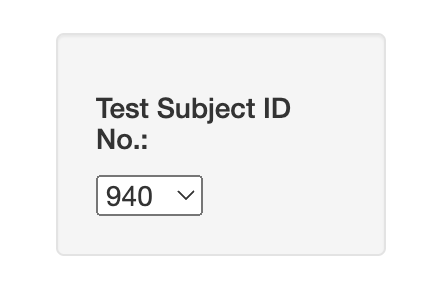
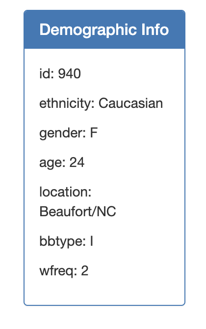
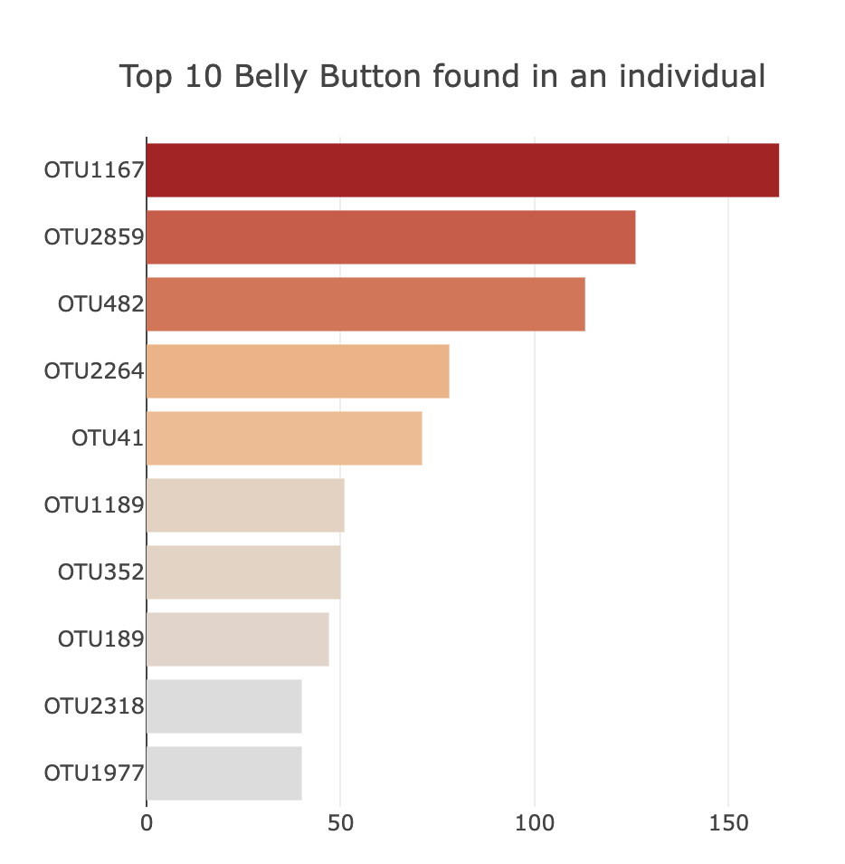
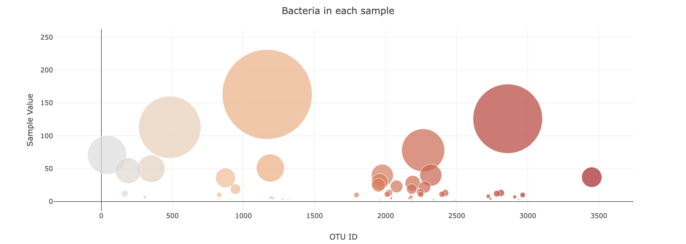
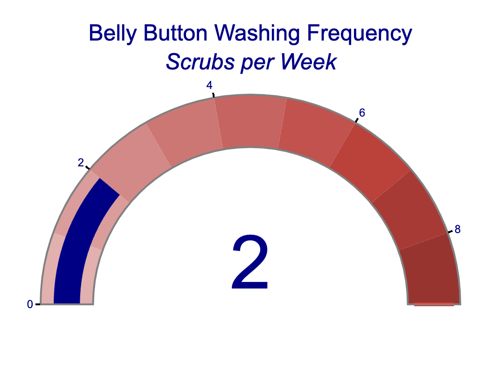

# belly-button-challenge

# Background

Here's  an interactive dashboard to explore the [Belly Button Biodiversity dataset](http://robdunnlab.com/projects/belly-button-biodiversity/), which catalogs the microbes that colonize human navels.

The dataset reveals that a small handful of microbial species (also called operational taxonomic units, or OTUs, in the study) were present in more than 70% of people, while the rest were relatively rare.

# Preview of the dataset

FYI: code locates in `static` file as `app.js`

### Dropdown menu 

to choose the data you want to see:

### Demographic info 

to see an individual's demographic information:

### A bar Chart 

to display the top 10 OTUs found in that individual:

### A bubble chart 

that displays each sample:

### A Gauge Chart 

to plot the weekly washing frequency of the individual:

